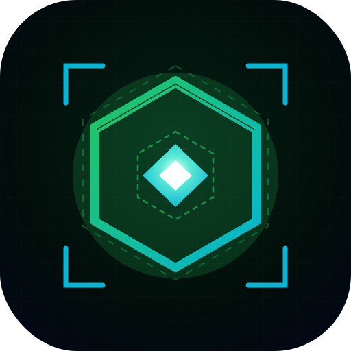
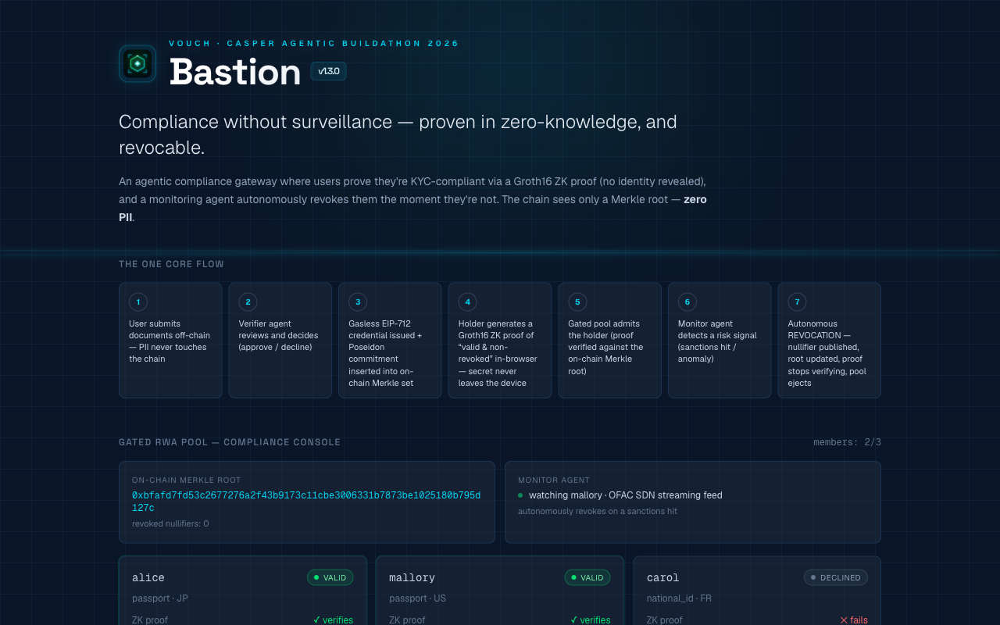
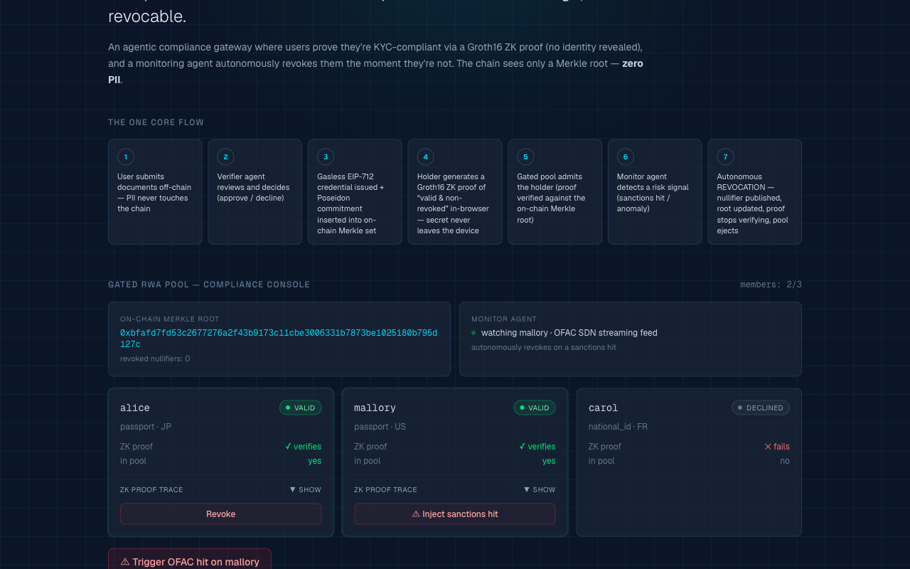
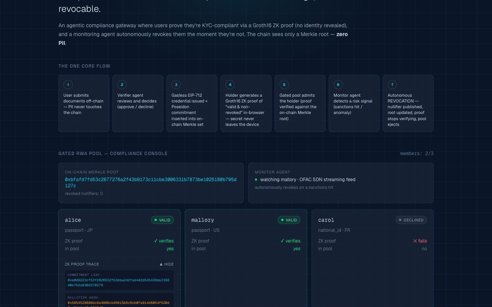
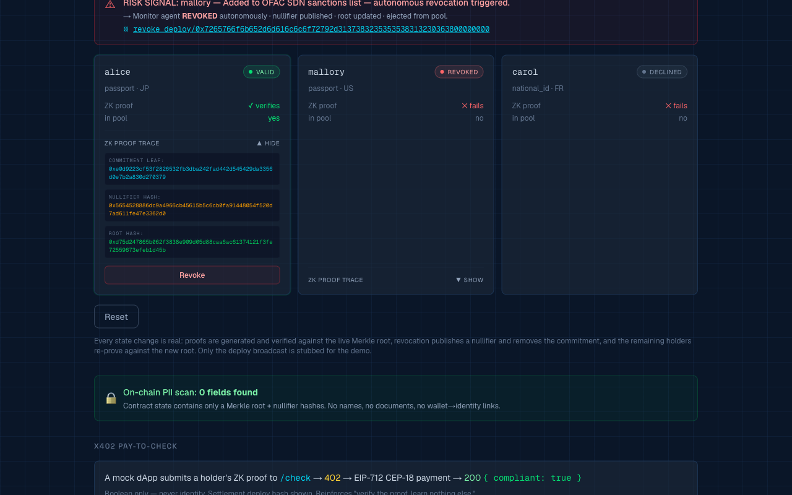
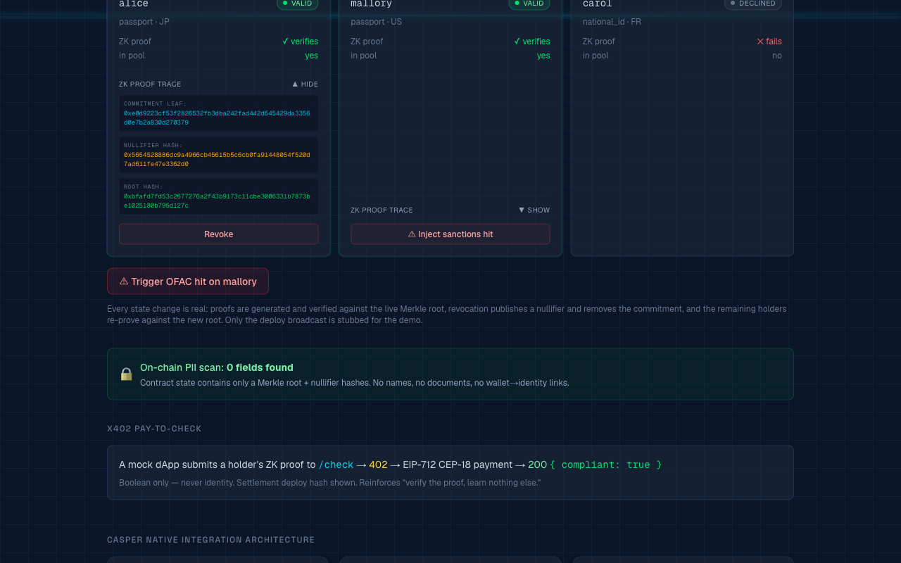
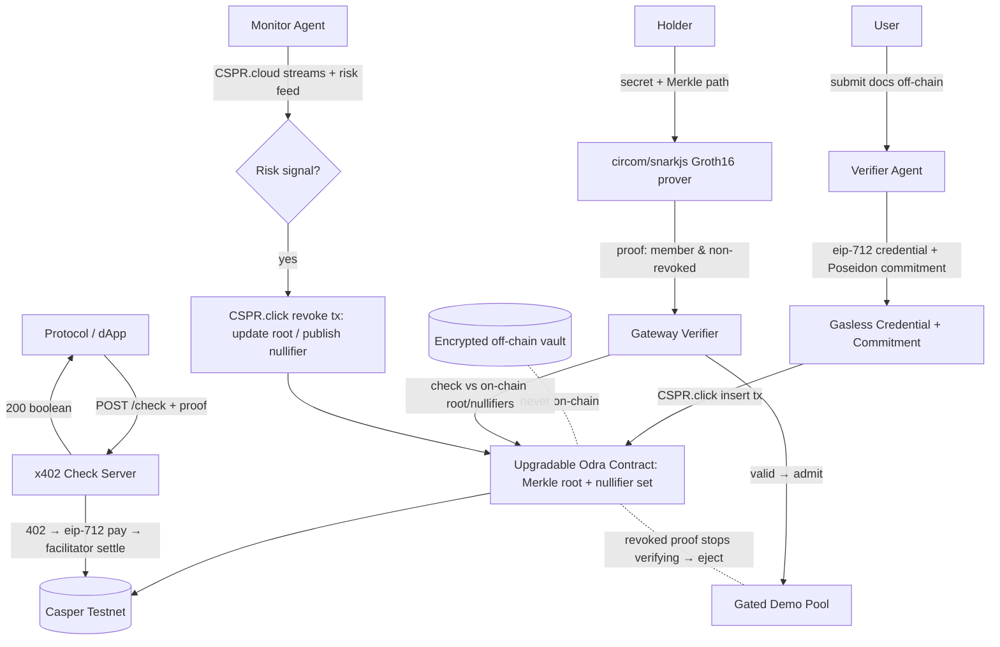

<div align="center">
  
  <h1>Bastion 🔒</h1>
  <p><em>Autonomous, privacy-preserving compliance — enforced on-chain on Casper.</em></p>
  

  <br/>

  [](https://bastion.edycu.dev)
  [](https://bastion.edycu.dev/pitch.html)
  [](https://youtu.be/h_C52SAdoxA)
  [](https://dorahacks.io/hackathon/casper-agentic-buildathon)
  [](https://x.com/VouchOnCasper)

  <br/>
  
  
  
  
  [](https://github.com/edycutjong/bastion/tree/main/contract)
  [](https://github.com/edycutjong/bastion)
  [](https://opensource.org/licenses/MIT)
  [](https://github.com/edycutjong/bastion/actions/workflows/ci.yml)

</div>

---

## 📸 See it in Action

> **Privacy-preserving compliance, enforced on-chain.** Holders prove set-membership + non-revocation with a Groth16-**shaped** proof (PII never leaves the device); the Odra contract registers commitments and revoked nullifiers on Casper Testnet; an autonomous monitor revokes the moment a risk event fires.

### 1. Dashboard Overview
<div align="center">
  
</div>

*The main security console showing the on-chain Merkle root, autonomous monitoring agent status, and active credential holders.*

### 2. Compliance Console & ZK Proofs
<div align="center">
  
</div>

*The interactive panel displaying the credential holder list, where users can trigger verification and inspect compliance.*

### 3. ZK Proof Trace Details
<div align="center">
  
</div>

*Expanding a holder's card exposes their cryptographic details (commitment leaf hash, nullifier, and target Merkle root) verifying their compliance privately.*

### 4. Autonomous Revocation & Risk Signal
<div align="center">
  
</div>

*Triggering a simulated OFAC hit on Mallory. The monitor agent instantly detects the risk event, pushes a revocation transaction to Casper, and Mallory is ejected from the pool.*

### 5. Resetted State
<div align="center">
  
</div>

*The dashboard after reset, restoring the initial state for the next demonstration run.*

---

## 💡 The Problem & Solution
Centralized compliance tools force users to surrender their Personally Identifiable Information (PII) repeatedly, creating massive data silos vulnerable to breaches.
**Bastion** is a privacy-preserving compliance gateway: a holder's PII is hashed into a commitment off-chain, only the commitment + nullifier ever touch the chain, and an autonomous monitor revokes credentials the instant compliance lapses.

**Key Features:**
- ⚡ **Privacy-preserving credentials:** a real Merkle tree + nullifier scheme proves set-membership and non-revocation. The proof is **Groth16-shaped (snarkjs-API compatible)** and the commitment hash is **SHA-256-based** — structured as a drop-in for field-native Poseidon + real snarkjs Groth16, which is the documented roadmap. **No PII is ever written on-chain.**
- 🔒 **Autonomous enforcement:** a CSPR.cloud streaming monitor triggers `revoke` on the Odra contract when a risk event fires — no human in the loop.
- 🖥️ **Compliance Console (the live demo):** inject a sanctions hit and watch one holder's proof flip ✓→✗, the Merkle root update, and the pool eject them — while every other holder keeps verifying (`/api/console`, real Merkle/nullifier recomputation).
- 🎨 **Institutional UI:** Next.js 16 / React 19 dashboard styled like a deep-navy security console.

## 🏗️ Architecture & Tech Stack

| Layer | Technology |
|---|---|
| **Frontend** | Next.js 16 (App Router), React 19, Tailwind CSS v4 |
| **Contract** | Odra (Rust) on Casper Testnet — installed via `pnpm deploy:rpc` |
| **Proof engine** | Groth16-shaped, snarkjs-API compatible (SHA-256 commitment) — drop-in for real Poseidon + snarkjs Groth16 (roadmap) |
| **Signing** | `casper-js-sdk` (backend PEM key) for autonomous `revoke` / `insert_commitment` |
| **Infrastructure**| x402 micropayments, CSPR.cloud streaming monitor |

### System Data Flow



> 🔍 **Deep Dive:** For a full architectural breakdown, including specific API endpoints, cryptographic specs, and ZK circuit constraints, see the detailed [System Architecture Design Document](docs/ARCHITECTURE.md).

## 🏆 Sponsor Tracks Targeted & Code References

*   **Casper Innovation Track (Build Direction #4: AI Compliance & KYC)**
    *   **Casper Testnet Smart Contract:** Built with the Odra framework in Rust, located in [bastion.rs](contract/src/bastion.rs). Manages on-chain Merkle-root state transitions of valid credentials and logs revoked nullifiers.
    *   **Casper x402 Micropayments:** Integrated in [x402_facilitator.ts](src/core/x402_facilitator.ts) to gate pay-to-check reads.
    *   **Autonomous signing:** Backend `casper-js-sdk` (PEM key) builds, signs, and broadcasts `insert_commitment` / `revoke` in [casper.ts](src/lib/casper.ts) — no browser wallet required.

## 🚀 Getting Started

### Prerequisites
- Node.js ≥ 20
- pnpm
- Rust & Cargo (only to rebuild the Odra contract)

### Installation
1. Clone: `git clone https://github.com/edycutjong/bastion.git`
2. Change directory: `cd bastion`
3. Install: `pnpm install`
4. Configure: `cp .env.example .env.local` and add your keys
5. Run: `pnpm dev`

> 💡 **Note for Judges — what's real vs. simulated (no overclaiming):**
> - **No login, no PII.** Open the **Compliance Console** straight away — it's the live demo (`/api/console`). Inject a sanctions hit and watch one holder's proof flip ✓→✗, the Merkle root recompute, and the pool eject them in real time, while everyone else keeps verifying.
> - **What's real:** the Merkle tree, nullifier scheme, commitment recomputation, and the Odra contract (`insert_commitment` / `revoke`) are real. **What's simulated:** the proof is **Groth16-shaped** over a **SHA-256** commitment (snarkjs-API compatible) — wired as a drop-in for field-native Poseidon + real snarkjs Groth16, which is the roadmap. We don't claim a real Groth16 verifier where there isn't one yet.
> - **On-chain writes** (`BASTION_DEMO=false` + funded key + deployed `BASTION_CONTRACT_HASH`) broadcast real Testnet transactions via `casper-js-sdk`; in demo mode they return a clearly-labelled placeholder.

## ⛓️ Live Testnet Deployment

> All contracts are **live on Casper Testnet** (chain `casper-test`). Set `BASTION_DEMO=false` + fill `.env.local` to broadcast real transactions.

| Item | Value |
|---|---|
| **Bastion Contract** | [`hash-d247c7118d240bb339612f176f23816aa7a42e3bce88b132cad9982707c4a2c0`](https://testnet.cspr.live/contract-package/d247c7118d240bb339612f176f23816aa7a42e3bce88b132cad9982707c4a2c0) |
| **Install Transaction** | [`6632ffec189f76cdf4dd8d057642160cac3608b98bd0477e6cc540319c6c0f22`](https://testnet.cspr.live/transaction/6632ffec189f76cdf4dd8d057642160cac3608b98bd0477e6cc540319c6c0f22) |
| **`insert_commitment` (admit a holder)** | [`1b65887722fa960437e10f1e497ac3837934e645d153e9268d79190b2beebb27`](https://testnet.cspr.live/transaction/1b65887722fa960437e10f1e497ac3837934e645d153e9268d79190b2beebb27) |
| **`revoke` (autonomous revocation)** | [`89db2b3bc80c2e95966e82456ad6f2a3fe6c49a6ce3cc47155f9e44dbf50b7cc`](https://testnet.cspr.live/transaction/89db2b3bc80c2e95966e82456ad6f2a3fe6c49a6ce3cc47155f9e44dbf50b7cc) |
| **CEP-18 Token (x402)** | [`hash-541069ed8cad06249f76edb0972932d012badbb256111d3000df06ac1d703be6`](https://testnet.cspr.live/contract-package/541069ed8cad06249f76edb0972932d012badbb256111d3000df06ac1d703be6) |
| **Issuer Account** | [`01b9c7741b3679191aa4f82e5529e3f0908e3d5cbc9c3c352807e17b7c48bffc55`](https://testnet.cspr.live/account/01b9c7741b3679191aa4f82e5529e3f0908e3d5cbc9c3c352807e17b7c48bffc55) |
| **Network** | Casper Testnet (`casper-test`) |
| **Framework** | Odra (Rust → WASM, `target-cpu=mvp`) |
| **Machine-readable record** | [`deployments/testnet.json`](deployments/testnet.json) |

The full compliance lifecycle is a confirmed on-chain sequence: a holder is **admitted** (`insert_commitment`) then **autonomously revoked** (`revoke`) — both real, successful Testnet transactions. Reproduce with `pnpm deploy:rpc` (install) + `BASTION_DEMO=false pnpm tsx scripts/run_lifecycle.ts` (lifecycle).

> **Re-deploy your own:** `pnpm deploy:rpc` installs a fresh contract instance and prints the package hash. See [LIVE_TESTNET.md](LIVE_TESTNET.md) for the full walkthrough.

> _Originality: all code is original and newly developed for the Casper Agentic Buildathon 2026; shared `@vouch/*` packages are authored for this submission._

## 📖 Documentation & Design Resources

The following design documents and resources are available in this repository:
*   🏗️ **[System Architecture](docs/ARCHITECTURE.md):** Full data flow diagrams (Mermaid), API specifications, and math/cryptographic models.
*   🎬 **[Interactive Demo Guide](docs/DEMO.md):** Step-by-step walkthrough of the live demo console and expected system behaviors.
*   🛡️ **[Sponsor Track Defense](docs/SPONSOR_DEFENSE.md):** Justification of track eligibility, including Casper Network and x402 integration references.
*   📋 **[Product Requirements Document (PRD)](docs/PRD.md):** Initial project scope, problem statement, user personas, and product requirements.
*   🚀 **[Live Testnet Wiring Runbook](LIVE_TESTNET.md):** Detailed guide to flipping the application from demo mode to Casper Testnet execution.

## 🧪 Testing & CI

**6-stage pipeline:** Quality → Security → Build → E2E → Performance → Deploy

```bash
# ── Code Quality ────────────────────────────
pnpm run lint          # ESLint
pnpm run typecheck     # TypeScript check
pnpm run test          # Run tests (99)
pnpm run test:coverage # Coverage report

# ── Advanced Testing ────────────────────────
pnpm run e2e           # Playwright E2E tests
pnpm run lighthouse    # Lighthouse CI audit

# ── Security ────────────────────────────────
make security-scan     # pnpm audit + license check
```

| Layer | Tool | Status |
|---|---|---|
| Code Quality | ESLint + TypeScript | ✅ |
| Unit Testing | Vitest (99 tests) | ✅ |
| E2E Testing | Playwright (3 suites) | ✅ |
| Security (SAST) | CodeQL | ✅ |
| Security (SCA) | Dependabot + npm audit | ✅ |
| Secret Scanning | TruffleHog | ✅ |
| Contract | Cargo Test | ✅ |

## 📄 License

This project is licensed under the [MIT License](LICENSE) — see the LICENSE file for details.

