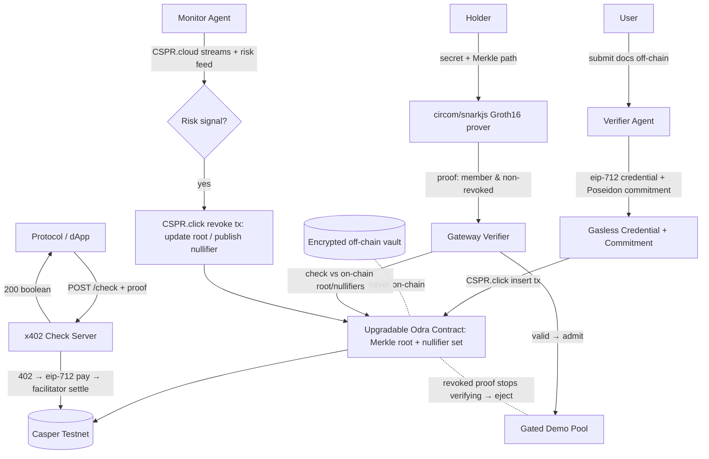

# Bastion — Architecture

## Tech stack
- **Frontend:** Next.js + React + Tailwind/shadcn. Vercel. Two surfaces: a user verification/proof flow and a protocol/admin console.
- **Agents:** Node/TypeScript. A **Verifier agent** (LLM-assisted document check on mock inputs) and a **Monitor agent** (watches CSPR.cloud streams + a risk feed → triggers revocation).
- **Credential issuance:** **casper-eip-712** typed-data signatures (JS) — gasless, PII-free.
- **Zero-knowledge:** **circom** circuit + **snarkjs** (Groth16) for set-membership + non-revocation proofs; Poseidon hash for commitments/Merkle tree.
- **On-chain:** **upgradable Odra** credential contract on Casper **Testnet** (stores Merkle root + nullifier/revocation set).
- **Signing:** CSPR.click AI Agent Skill (`casper-js-sdk` TransactionV1) for issuance + revocation.
- **x402:** check endpoint behind the CSPR.cloud facilitator (boolean compliance checks).
- **State:** Supabase — off-chain PII vault (encrypted, never on-chain), commitment index, risk events.

## Privacy model (precise)
- The user's PII is verified off-chain and stored **encrypted off-chain** (or discarded). On-chain we store only: the **Merkle root** of valid credential commitments + a **nullifier/revocation set**. No per-user row, no wallet→identity link.
- A **commitment** = `Poseidon(secret, attributes_hash)`; the user holds `secret` (and the eip-712 credential) off-chain. The chain never sees the secret, the attributes, or which leaf is whose.
- **Proving compliance** = a Groth16 proof that `Poseidon(secret, attrs)` is a leaf under the current root **and** its nullifier ∉ revocation set — verified against the on-chain root. The verifier learns only "valid & non-revoked," never identity.
- An audit script (`scripts/scan_pii.ts`) reads full contract state and asserts no field decodes to PII (only a root + nullifiers).

## System architecture (Mermaid)

## The Odra contract (upgradable, Rust)
- `insert_commitment(commitment, attestation_sig)` — verifies the eip-712 issuance signature, adds the leaf, updates the **Merkle root**, sets the commitment `valid`.
- `revoke(commitment_or_nullifier, reason_code)` — agent/admin; removes the leaf / publishes the nullifier and updates the root. **Upgradable** so criteria can evolve.
- `current_root() -> hash`, `is_nullified(nullifier) -> bool` — what the gateway verifier reads to check a proof.
- `status(commitment) -> {valid|revoked|expired}`.
- Admin **force-revoke** + upgrade authority documented (not pretended trustless).
- **Roadmap:** a native Groth16 verifier entrypoint (`verify_compliance(proof, publicSignals) -> bool`) so verification is fully on-chain; MVP verifies in the gateway against `current_root()`/`is_nullified()`.

## The ZK circuit (circom, Groth16)
- **Private inputs:** `secret`, `attributes`, Merkle path + siblings.
- **Public inputs:** `root`, `nullifierHash`, an optional `context` (e.g., pool id) to bind the proof.
- **Constraints:** `Poseidon(secret, attrs)` is a leaf under `root`; `nullifierHash == Poseidon(secret, context)` (prevents double-use + enables revocation); reveals nothing else.
- Compiled with snarkjs; proving runs in the browser/worker so the `secret` never leaves the device.

## x402 check flow (thin, non-core)
`POST /check {proof, publicSignals}` → 402 → consumer signs eip-712 CEP-18 payment → CSPR.cloud facilitator verify+settle → server verifies the Groth16 proof against `current_root()`/`is_nullified()` → 200 `{compliant: true|false}`. Issuance/revocation/proving never touch x402.

## API endpoints
- `POST /api/verify` — user submits docs (off-chain), agent decides.
- `POST /api/issue` — issue credential (eip-712) + `insert_commitment` via CSPR.click.
- `POST /api/prove` — holder generates a Groth16 proof locally (secret never sent); returns proof + publicSignals.
- `POST /internal/revoke` — monitor/admin revoke (update root / nullifier).
- `POST /check` — x402-gated proof verification → boolean.
- `GET /api/pool` — gated demo pool membership (admits valid proofs).

## Key libraries / SDKs
`casper-eip-712` (JS), `casper-js-sdk` (CSPR.click), **circom + snarkjs** (Groth16), **circomlibjs** (Poseidon), Odra + `cargo-odra`, CSPR.cloud streaming, CSPR.cloud x402 facilitator, Next.js, Supabase. Reuses `@vouch/x402-casper-js` (from Verity) and `@vouch/conclave-mcp-tools` (from Conclave) — the shared spine.
