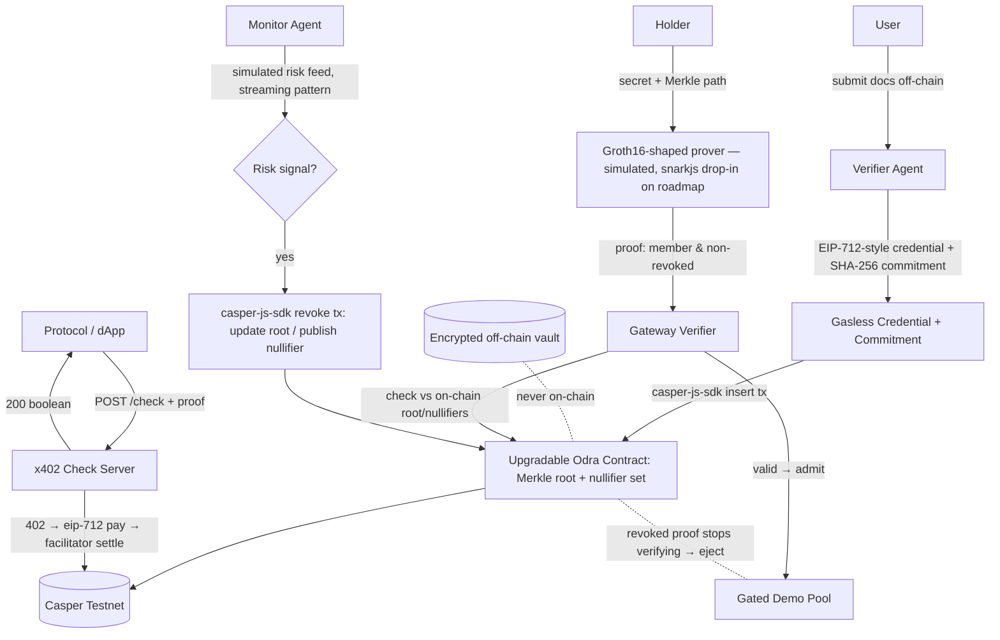

# Bastion — Architecture

## Tech stack
- **Frontend:** Next.js + React + Tailwind/shadcn. Vercel. Two surfaces: a user verification/proof flow and a protocol/admin console.
- **Agents:** Node/TypeScript. A **Verifier agent** (LLM-assisted document check on mock inputs) and a **Monitor agent** (follows a streaming pattern over a deterministic simulated risk feed → triggers revocation).
- **Credential issuance:** **EIP-712-style** typed-data attestation — gasless, PII-free. The attestation is a **SHA-256 stand-in** (`src/core/attest.ts`) in the MVP; real `casper-eip-712` typed-data signing is on the roadmap.
- **Zero-knowledge:** **Groth16-shaped simulation** (SHA-256; `src/core/zk.ts` + `src/core/poseidon.ts` mirror the snarkjs `pi_a/pi_b/pi_c` shape) for set-membership + non-revocation proofs. Real circom/snarkjs Groth16 + field-native Poseidon are on the roadmap.
- **On-chain:** **upgradable Odra** credential contract on Casper **Testnet** (stores Merkle root + nullifier/revocation set).
- **Signing:** **casper-js-sdk** (backend PEM key → `putTransaction`) for issuance + revocation — no browser wallet required.
- **x402:** check endpoint behind the CSPR.cloud facilitator (boolean compliance checks).
- **State:** deterministic fixtures + in-memory orchestration (`data/fixtures/`) — off-chain PII is modeled as an encrypted vault that never touches the chain; only the commitment index + risk events are exercised.

## Privacy model (precise)
- The user's PII is verified off-chain and stored **encrypted off-chain** (or discarded). On-chain we store only: the **Merkle root** of valid credential commitments + a **nullifier/revocation set**. No per-user row, no wallet→identity link.
- A **commitment** = `Poseidon(secret, attributes_hash)`; the user holds `secret` (and the eip-712 credential) off-chain. The chain never sees the secret, the attributes, or which leaf is whose.
- **Proving compliance** = a Groth16 proof that `Poseidon(secret, attrs)` is a leaf under the current root **and** its nullifier ∉ revocation set — verified against the on-chain root. The verifier learns only "valid & non-revoked," never identity.
- An audit script (`scripts/scan_pii.ts`) reads full contract state and asserts no field decodes to PII (only a root + nullifiers).

## System architecture (Mermaid)

```mermaid
flowchart TD
    U[User] -->|submit docs off-chain| VER[Verifier Agent]
    VER -->|EIP-712-style credential + SHA-256 commitment| CRED[Gasless Credential + Commitment]
    CRED -->|casper-js-sdk insert tx| REG[Upgradable Odra Contract: Merkle root + nullifier set]
    REG --> TN[(Casper Testnet)]
    PII[(Encrypted off-chain vault)] -. never on-chain .- REG
    U2[Holder] -->|secret + Merkle path| ZK[Groth16-shaped prover — simulated, snarkjs drop-in on roadmap]
    ZK -->|proof: member & non-revoked| GATE[Gateway Verifier]
    GATE -->|check vs on-chain root/nullifiers| REG
    GATE -->|valid → admit| POOL[Gated Demo Pool]
    MON[Monitor Agent] -->|simulated risk feed, streaming pattern| RISK{Risk signal?}
    RISK -->|yes| REV[casper-js-sdk revoke tx: update root / publish nullifier]
    REV --> REG
    REG -. revoked proof stops verifying → eject .- POOL
    DAPP[Protocol / dApp] -->|POST /check + proof| XQ[x402 Check Server]
    XQ -->|402 → eip-712 pay → facilitator settle| TN
    XQ -->|200 boolean| DAPP
```

## The Odra contract (upgradable, Rust)
- `insert_commitment(commitment, attestation_sig)` — verifies the EIP-712-style issuance attestation (SHA-256 stand-in in MVP), adds the leaf, updates the **Merkle root**, sets the commitment `valid`.
- `revoke(commitment_or_nullifier, reason_code)` — agent/admin; removes the leaf / publishes the nullifier and updates the root. **Upgradable** so criteria can evolve.
- `current_root() -> hash`, `is_nullified(nullifier) -> bool` — what the gateway verifier reads to check a proof.
- `status(commitment) -> {valid|revoked|expired}`.
- Admin **force-revoke** + upgrade authority documented (not pretended trustless).
- **Roadmap:** a native Groth16 verifier entrypoint (`verify_compliance(proof, publicSignals) -> bool`) so verification is fully on-chain; MVP verifies in the gateway against `current_root()`/`is_nullified()`.

## The ZK circuit (Groth16-shaped simulation; real circom/snarkjs on roadmap)
> The MVP simulates this circuit with SHA-256 stand-ins (`src/core/zk.ts`, `src/core/poseidon.ts`) that mirror the snarkjs proof/public-signal shape. The design below is the target the simulation is wired as a drop-in for.
- **Private inputs:** `secret`, `attributes`, Merkle path + siblings.
- **Public inputs:** `root`, `nullifierHash`, an optional `context` (e.g., pool id) to bind the proof.
- **Constraints:** `Poseidon(secret, attrs)` is a leaf under `root`; `nullifierHash == Poseidon(secret, context)` (prevents double-use + enables revocation); reveals nothing else.
- Target: compiled with snarkjs, proving in a browser/worker so the `secret` never leaves the device. In the MVP the proof object is computed server-side and the secret is never returned to the client.

## x402 check flow (thin, non-core)
`POST /check {proof, publicSignals}` → 402 → consumer signs an EIP-712-style CEP-18 payment → CSPR.cloud facilitator verify+settle (`src/core/x402_facilitator.ts`, gated to `BASTION_DEMO=false`; mocked in demo) → server verifies the Groth16-shaped (simulated) proof against `current_root()`/`is_nullified()` → 200 `{compliant: true|false}`. Issuance/revocation/proving never touch x402.

## API endpoints
- `POST /api/verify` — user submits docs (off-chain), agent decides.
- `POST /api/issue` — issue credential (EIP-712-style, SHA-256 stand-in) + `insert_commitment` via casper-js-sdk.
- `POST /api/prove` — generates a Groth16-shaped (simulated) proof; the secret is never returned to the client; returns proof + publicSignals.
- `POST /internal/revoke` — monitor/admin revoke (update root / nullifier).
- `POST /check` — x402-gated proof verification → boolean.
- `GET /api/pool` — gated demo pool membership (admits valid proofs).

## Key libraries / SDKs
Actual runtime dependencies (`package.json`): `casper-js-sdk` (backend PEM signing/broadcast), `@anthropic-ai/sdk` (Claude compliance officer), `ethers` (hashing/encoding helpers), `next` + `react` (dashboard). Contract: Odra + `cargo-odra`. CSPR.cloud is used as the RPC node URL + x402 facilitator endpoint (`src/lib/config.ts`). Reuses `@vouch/x402-casper-js` (from Verity) — the shared spine.

**Roadmap (not yet dependencies):** real `casper-eip-712` typed-data signing, `circom` + `snarkjs` (Groth16) with `circomlibjs` (field-native Poseidon), and CSPR.cloud event streaming for the monitor. The ZK/attestation/monitor layers today are SHA-256 stand-ins and a simulated risk feed that mirror those APIs.
